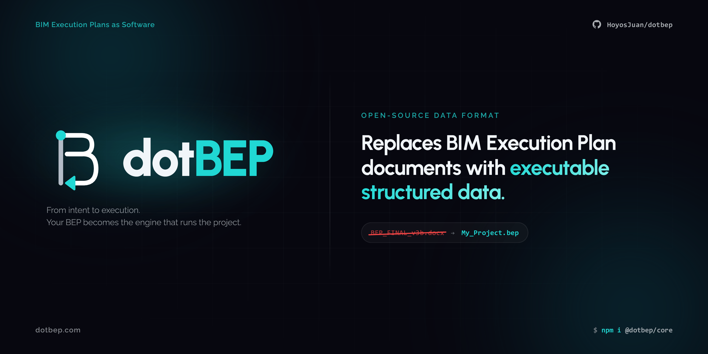

# dotBEP

## What is this?

An open .bep **data format designed to author and run BIM Execution Plans (BEPs)**. The goal is to replace text-based BEPs with a structured data format that enables:

- Integration with AI agents to manage the BEP in natural language.
- Dynamic and custom frontends for navigating BEPs.
- Integration with BIM apps as a contract on how they must behave for a project.
- Deriving information like responsibility matrices, TIDPs, MIDPs, deliverable naming codes, etc.
- Build BEP software, so they are treated as programs rather than documents.
- A transparent version history.

The BEP data is designed to answer:

| Question | Schema |
| --- | --- |
| What is this document about? | `project.description` |
| What project are we working on? | `project` — `name`, `code`, `clientId` |
| Who will participate? | `members`, `roles`, `teams` |
| What will each participant do? | `roles` → `teams` → `members`, RACI per workflow node |
| What will we do and why? | `bimUses`, `objectives` |
| What do we need to do it? | `softwares`, `bimUses[].software` |
| What is the model scope? | `lods`, `lois`, `loin` |
| How and with what guidelines will we do it? | `workflows`, `actions`, `standards`, `guides` |
| How do we ensure success? | runtime |
| Who delivers what and when? | `deliverables`, `milestones`, `phases`, `lbs` |

---

## The `.bep` format

A `.bep` file is a **zip** with the following structure:

```
project.bep
├── bep.json                          ← current state (latest version)
├── changelog.json                    ← { current, versions[] }
├── baseline/                         ← last committed state (reference for diffs and discard)
│   ├── bep.json                      ← JSON snapshot of the previous version (cache for commits)
│   └── standards/
│       └── {standard-id}.md          ← baseline of each .md at the time of the last commit
├── changelog/
│   ├── v0.0.json                     ← initial snapshot (terminus of the diff chain)
│   ├── v0.1.diff.json                ← inverse diff: how to go from v0.1 → v0.0
│   ├── v1.0.diff.json                ← inverse diff: how to go from v1.0 → v0.x
│   └── standards/
│       └── {standard-id}/
│           └── v0.3.md               ← .md snapshot only if it changed in that version
├── standards/
│   └── {uuid}.md
├── guides/
│   └── ifc-guide.pdf
├── memory.md                         ← collective project memory (not versioned) usually managed proactively by an LLM
└── skills/
    └── {skill-name}/
        ├── SKILL.md                  ← LLM behavior for this skill (not versioned)
        └── resources/
            └── {filename}           ← supporting files for the skill
```

---

## Key design decisions

- Every schema entity is connected with others.
- Every schema entity has a clear and justifiable purpose in runtime.
- Every key in the schema is very self-explanatory, no matter if its verbose.
- **Everything is flat with ID-based references** — no deeply nested objects. `teams` have `memberEmails: string[]`, not nested Member objects.
- **`bep.json` always reflects the current state** (latest version). History is reconstructed by applying inverse diffs backwards.
- BEPs are versioned as **two-number `{major}.{minor}`**.
- There are files such as skills and memory which are LLM-first.
- There are schema entities, such as flags, wich are LLM-first.
- Some data can be derived from the existing schema entities, so no need to have them explicit to avoid bloated files:
  - Naming code for any deliverable
  - Responsibility matrix (crossing `FlowNode` RACI role IDs with `roles`, `members` and `teams`)
  - TIDP per team (filtering `deliverables` by `responsibleId`)
  - MIDP (all deliverables)
  - ISO 19650 team diagram (graph of `teams` by `isoRole`)
  - Any historical version (applying inverse diffs backwards from `bep.json`)
  - etc...

---

## Documentation

Detailed documentation for the format and schema lives in [`docs/`](./docs):

- [`docs/format/`](./docs/format) — `.bep` file structure, versioning model, `memory.md`, `skills/`
- [`docs/schema/`](./docs/schema) — all schema entities: project, participants, workflows, deliverables, etc.